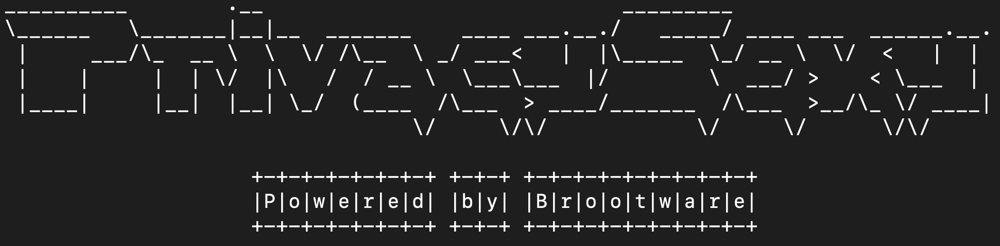

# Privacy-sexy-lite

<p align="center">
  
</p>

A lite CLI version of Open-source tool to enforce privacy & security best-practices on Windows and MacOS. Originally a web app by [undergroundwires](https://github.com/undergroundwires). 🍑 🍆

This tool is customized from original site [privacy.sexy](https://privacy.sexy) to fit privacy and security needs for my mac and windows VMs.

> Standard Disclaimer: Author assumes no liability for any damage done on your machines.

## Core Features

- 💻 Cross platform. Both Windows and MacOS.
- 🪶 Ultra light! No compiled binaries. Just plain old bash,batch and powershell scripts.
- 🙅 Automated security and privacy hardening on your Operating System.
- 🔁 Automated reversion of the security and privacy hardening.
- 🧹 Automated privacy cleanups.

## How to use for Mac

```bash
rm -rf privacy-sexy-lite
git clone https://github.com/brootware/privacy-sexy-lite
cd privacy-sexy-lite
chmod +x enforce_mac.sh
sudo ./enforce_mac.sh --help
```

## What's included in Mac?

- **Secure Mac**
  - Disable remote login
  - Disable insecure TFTP service
  - Disable Bonjour multicast advertising
  - Disable insecure telnet protocol
  - Disable sharing of local printers with other computers
  - Disable printing from any address including the Internet
  - Disable remote printer administration
  - Disable Captive portal
- **Configure Privacy**
  - Disable Remote Apple Events
  - Disable AirDrop file sharing
  - Opt-out from Siri data collection
- **Prviacy cleanup**
  - Clear Terminal History
  - Clear Browser History
  - Clear 3rd party application data
  - IOS Cleanup
  - Reset Privacy Permissions for all applications
  - Clear cups printer job cache
  - Empty trash on all volumes
  - Clear system cache files
  - Clear XCode derived data and archives
  - Clear DNS Cache
  - Purge inactive memory

## How to use for Windows

Right click > Run Powershell As Administrator

```powershell
rm -Force privacy-sexy-lite
git clone https://github.com/brootware/privacy-sexy-lite
cd privacy-sexy-lite
.\enforce_windows.ps1 help
```

## What's included in Windows?

- **Secure windows**
  - Disable unsafe features
  - Disable administrative shares
  - Disable autoplay and autorun
  - Disable remote assitance
  - Disable lock screen camera
  - Prevent the storage of lan manager hash of passwords
  - Disable windows installer always install with elevated privileges
  - Prevent WinRM from using basic authentication
  - Restrict anonymous enmeration of shares
  - Refuse less secure authentication
  - Enable structured exception handling overwrite protection
  - Block anonymous enumeration of SAM accounts
  - Restrict anonymous access to named pipes and shares
  - Disable the windows connect now wizard
- **Configure privacy**
  - Disable windows telemetry and data collection
  - Deny app access to personal information
  - Disable location access
  - Disable window search data collection
  - Disable targeted ads and marketing
  - Disable windows insider program
  - Disable cloud sync
  - Disable cloud speech recognition
  - Opt out from windows privacy consent
  - Disable windows feedback
  - Disable text and handwriting collection
  - Disable turn off sensors
  - Disable wi-fi sense
  - Disable inventory collector
  - Disable website access of language list
  - Disable auto downloading maps
  - Disable steps recorder
  - Disable game screen recording
  - Disable Windows DRM internet access
  - Disable feedback on write(Sending type info to Microsoft)
  - Disable activity feed
  - Disable media player data collection
  - Disable Xbox services
  - Disable Microsoft retail demo experience

    *and many more....*

- **Privacy & bloatware cleanup**
  - Clear app, browser history
  - Clear non essential windows logs and caches
  - Delete controversial Default- User
  - Enable reset base in DISM component store
  - Remove Default apps associations
  - Clear (RESET) network data usage
  - Uninstall MSN(BING), Office, XBox, Cortana, Feedback hub, Windows maps app
  - Uninstall Microsoft advertising app, Network speed test app.
  - Uninstall holographic first run app, family safety/parental controls app, Windows feedback app, CBS Preview app
